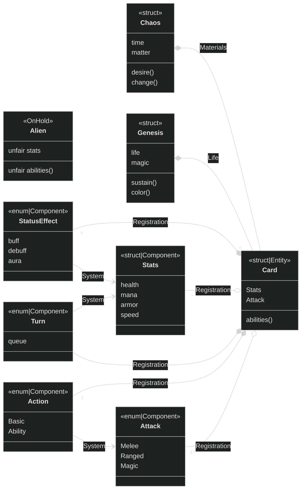

```mermaid
%%{init: { 'logLevel': 'debug', 'theme': 'dark' } }%%
classDiagram
direction LR
class Chaos{
  <<struct>>
    time
    matter
    desire()
    change()
}
class Genesis{
  <<struct>>
    life
    magic
    sustain()
    color()
}
class Card{
  <<struct|Entity>>
    Stats
    Attack
    abilities()
}
class Alien{
  <<OnHold>>
    unfair stats
    unfair abilities()
}
Genesis *-- Card : Life
Chaos *-- Card : Materials

%%Card <|-- Defense
%%Card <|-- Attacker
%%Card <|-- Caster

%%class Defense{ weight~armor~ protect() whack() }
%%class Attacker{ speed~attack~ flurry() }
%%class Caster{ amplify~magic~ replenish() }

class Stats{
  <<struct|Component>>
    health
    mana
    armor
    speed
}

class Status Effect{
  <<enum|Component>>
    buff
    debuff
    aura
}

class Turn{
  <<enum|Component>>
    queue
}

class Attack{
  <<enum|Component>>
    Melee
    Ranged
    Magic
}
class Action{
  <<enum|Component>>
    Basic
    Ability
}
Stats "*" --o Card :Registration
Attack "1?" --o Card :Registration
Action "1" --* Card :Registration
Status Effect "n" --* "n" Card :Registration

Turn --> Stats : System
Turn --* Card :Registration
Action --> Attack : System
Status Effect --> Stats : System
```
